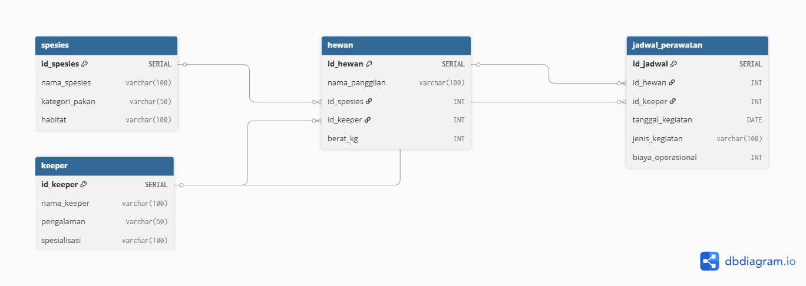

# zoo-data-analysis-sql
Keeper workload, medic, feeding budget

## Project Overview
Project ini adalah simulasi sistem database operasional Kebun Binatang. Tujuannya adalah merancang arsitektur database relasional dari nol dan menggunakan SQL untuk menjawab permasalahan bisnis terkait evaluasi beban kerja staf (keeper) dan efisiensi anggaran operasional (pakan dan medis).

## Tech Stack
- Database: PostgreSQL
- SQL Editor: DBeaver
- Data Modeling: dbdiagram.io
- Version Control: Git dan GitHub Desktop

## Database Schema (ERD)

Sistem ini didesain menggunakan Foreign Key constraints untuk menjaga referential integrity antar 4 tabel utama:
1. spesies: Master data klasifikasi hewan dan jenis pakan.
2. keeper: Master data staf dan tingkat pengalaman.
3. hewan: Data individu satwa yang terhubung dengan spesies dan keeper penanggung jawab.
4. jadwal_perawatan: Tabel transaksional yang mencatat kegiatan harian dan pengeluaran biaya.

## Business Scenarios and Queries

### Misi 1: Evaluasi Beban Kerja Keeper
Tujuan: Menghindari overwork pada staf dengan menganalisis dan memberikan peringkat beban tugas setiap keeper secara adil.
- Konsep SQL: WITH (CTE), JOIN, COUNT, DENSE_RANK(), ROW_NUMBER().
- File: case1_workload_keeper_evaluation.sql

### Misi 2: Analisis Anggaran Pakan dan Medis
Tujuan: Mengidentifikasi kategori pakan dan top 3 individu hewan spesifik yang menyedot biaya operasional tertinggi bulan ini untuk bahan evaluasi manajemen.
- Konsep SQL: Multi-table JOIN (3 tables), Aggregate SUM(), GROUP BY, LIMIT.
- File: case2_budget_analysis.sql

## Key Highlights
- Mengimplementasikan praktik terbaik penulisan SQL dengan memisahkan script DDL (Infrastruktur) dan DQL (Analitik).
- Menangani data dengan nilai seri (tie) secara akurat menggunakan Window Functions.